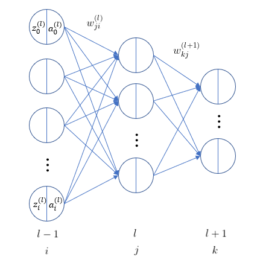

# 역전파법 Backpropagation

l층의 가중치 w를 업데이트하기 위해 기울기를 구한다고 하자

>

우변의 두 번째 항은 다음과 같다
>

>

우변의 첫 번째 항을 다시쓰면 다음과 같다

>

양변에 l, l+1 째 층의 입력에 대한 미분이 있는 것에 착안하여 다음과 같이 정의하고 델타(delta)라고 부른다
>

이어서 다음 식을 활용하면
>

아래와 같고 델타를 다시 쓸 수 있게된다
>

>

위 식은 l층 j번째 유닛의 델타를 l+1층의 델타들로 계산할 수 있음을 의미한다. 다시말해, 더 위층인 유닛에 대한 델타가 주어지면 l층의 델타를 위 식으로 계산할 수 있게 된다. 이렇게 출력 L층까지 거슬러 올라가 맨 처음 출력층의 유닛에 대한 델타가 계산되어 있으면 반복 계산하여 어떤 층이든 델타를 계산할 수 있다. 이때 델타가 출력층부터 입력층 방향, 그러니까 순전파와는 반대 방향으로 전파되는데, 이것이 역전파법이라는 이름의 유래가 된다.

이제 처음의 식을 델터를 활용해 다시 쓰면 다음과 같다

>

역전파되는 최초 값은 출력층의 델타L 이 주어지는데 다음과 같이 계산한다

>

구체적인 계산은 오차함수의 종류에 따라 다르다

### 출력층의 델타

역전파 계산의 시작점은 출력층의 델타L 이다. 이를 계산하는 방법은 사용하고 있는 오차함수나 출력층의 활성화 함수가 무엇이냐에 따라 다르지만 대표적인 예로 회귀를 살펴본다

#### 회귀

오차함수를 제곱오차, 출력층 활성화 함수는 항등사상으로 할 경우, 출력층의 유닛 j의 델타L은 다음과 같다

>

>

>

이진 분류, 다 클래스 분류의 경우에도 오차함수와 출력층의 활성화 함수는 다르지만 출력층 j의 델타L은 회귀와 동일하게 신경망의 출력과 목표 출력의 차가 된다
