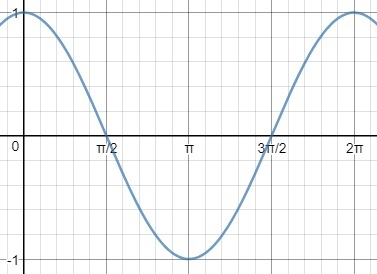

# 분류 Classification
---------------------
### 벡터
```
a = (a1, a2)인 벡터의 길이
```
>

```
두 벡터의 내적
```
>

```
어떤 직선에 수직인 벡터를 법선벡터라 한다
```
>

### 이진 분류
>
```
두 개의 요소(feature)를 가진 데이터를 두 그룹으로 분류한다고 하자
평면 위의 점을 직선으로 두 개의 그룹으로 나눌 수 있다
회귀와 같이 1차 함수의 기울기와 절편을 구하는 것이 아니라 벡터를 찾아야 한다
```
```
두 그룹으로 분류한 직선은 웨이트 벡터(w)를 법선 벡터로 한 직선이다
웨이트 벡터는 알고 싶은 미지의 매개변수이다
```
```
직선의 방정식은 벡터의 내적으로 나타낼 수 있다
```
>

```
두 개의 요소(n=2)를 가정하고 있으므로 아래와 같이 쓸 수 있다
```
> 

```
구체적인 값을 대입해서, w=(1, 1) 이라고 해보면
```
>

>

>
```
이것은 기울기가 -1인 직선이라 말할 수 있고, w=(1,1)과는 수직임을 알 수 있다
다시 말해 '웨이트 벡터를 법선 벡터로하는 직선'을 해석한 모습이다
```
>

> #### *웨이트 벡터를 찾아내면 수직인 직선을 알게되고 그 직선으로 데이터를 구분할 수 있다*
### 퍼셉트론
```
여러 개의 입력을 입력 받아 각각의 값에 웨이트를 곱해서 더한 것이 출력되는 형태
```
>

### 식별함수
##### *x1이 더 크거나 같은 그룹을 1로 하고, x2가 더 큰 그룹을 -1로 표시한다고 하자*
 - 가로가 더 길거나 같으면 1로 하고, 세로가 더 길면 -1로 표시한다
```
속성을 벡터 x로 표시하면, 1이나 -1을 반환하는 함수를 정의할 수 있다
```
>

```
내적의 부호에 따라 반환하는 값이 달라지는 함수라고 볼 수 있다
```
>

```
벡터의 크기는 항상 양수이므로 내적의 부호는 cosine이 결정한다
```
>

```
직선을 사이에 두고 웨이트 벡터와 반대가 되는 영역에 있는 벡터와는 내적이 음수가 된다
```
>

> #### *내적은 벡터끼리 얼마나 닮았는지 알 수 있는 지표가 된다. 부호가 양이면 닮은 것이고 0이면 직각, 음이면 닮지 않은 것을 의미한다.*
### 웨이트 벡터 갱신식
```
식별함수가 제대로 분류하지 못한 경우에만 새로운 웨이트 벡터(매개변수)를 갱신한다
```
>

```
무작위로 정한 벡터가 3사분면에 있다고 가정한다
그리고 첫 학습 데이터로 x=(125, 30)의 데이터가 있다고 하자
```
>

```
해당 데이터는 x1(가로)이 더 크므로 1로 분류되어 있다
하지만 웨이트 벡터와 내적은 음수이기 때문에 식별함수는 -1로 분류한다
분류에 실패하였으므로 갱신식을 적용한다
```
>

>

```
w + x(빨간색)이 새로운 w가 된다
새로운 w에 수직인 직선(파란색)을 그어보면 선이 회전되었음을 알 수 있다
```
>

```
갱신하기 전에는 웨이트 벡터와 반대편에 있었는데, 갱신 후에는 같은 방향에 있다
다시말해 갱신 후에는 내적이 양이 되어 식별함수가 1로 제대로 분류하게 된다
```
```
y가 -1인 경우에도 갱신식의 벡터의 덧셈이 뺄셈이 될 뿐 과정은 같다
이러한 갱신 과정을 모든 학습 데이터에 대해 반복해가는 것이 퍼셉트론 학습이다
```
### 선형분리가능
```
단층 퍼셉트론으로는 선형분리가능인 문제밖에 해결할 수 없다
직선을 한 개만 그어서 다음 데이터를 분류할 수 없는 것처럼, 직선으로 분류할 수 없는 경우는 선형분리가능이 아니다
```
>

```
다층 퍼셉트론(신경망)을 사용하거나 선형분리불가능인 문제에도 적용할 수 있는 알고리즘이 필요하다
```
### 로지스틱 회귀 logistic regression
```
분류를 확률로 생각한다
퍼셉트론(1, -1)과 달리 가로가 긴 것을 1, 세로가 긴 것을 0이라 가정한다(갱신식을 간결하게 함)
```
##### 시그모이드 sigmoid
```
매개변수가 있는 함수는 다음과 같이 정의할 수 있다
```
>
```
매개변수는 회귀를 할 때처럼 theta를 사용하면 함수의 모양은 다음과 같다
```
>

>

```
시그모이드 함수는 0 < f(x) < 1 이므로 확률처럼 다룰 수 있다
```
##### 최급하강법
```
미지의 데이터 x가 가로가 더 긴 모양일 때의 확률을 다음과 같이 정한다
```
>

```
0.5를 기준으로 크거나 같으면 가로로 길고, 작으면 세로로 길다고 분류할 수 있다
```
>
```
위 식은 아래와 같이 쓸 수도 있다
```
>

>
```
가로축이 x1이고, 세로축이 x2인 그래프를 생각하고, 임의의 매개변수를 이용하여 계산해 보면
```
>

>
>

```
그래프를 그려서 보면 다음과 같다
```
>

```
직선을 경계선으로 해서 한쪽이 가로로 긴 것, 다른 한쪽이 세로로 긴 것으로 분류된다
이렇게 데이터를 분류하기 위한 직선을 결정경계라고 한다
```
```
알맞은 매개변수 theta를 구하기 위해 목적함수를 정의하고 미분해서 매개변수 갱신식을 구하면 된다
이러한 알고리즘을 로지스틱 회귀라 한다
```
### 우도함수
```
로지스틱 회귀의 목적은 다음과 같이 말할 수 있다
```
> ```y=1``` 일때는 확률 ```P(y=1|x)``` 가 최대
> ```y=0``` 일때는 확률 ```P(y=0|x)``` 가 최대
```
학습 데이터 3개의 y가 0, 1, 0 라 가정하자
모든 학습 데이터는 서로 관계가 없이 독립적으로 발생한다고 생각하면 다음과 같다
```
>

```
이것을 일반화 해서 다시 쓰면
```
>

```
이 목적함수를 우도함수(Likelihood)라 한다
우도함수를 가장 크게 하는 매개변수가 학습 데이터를 가장 잘 설명한다
```
```
우도함수를 그대로 다루기에는 어려운 점이 있다
확률을 곱하면서 값이 점점 작아진다는 것과 곱셈이라는 점이다
양변에 로그(log)를 취해서 계산하기 쉽도록 한다
```
>

```
로그 함수는 단순 증가 함수이므로 우도함수를 최대화 하는 것과 로그를 취한 우도함수를 최대화 하는 것은 의미가 같다
```
```
로그를 취한 대수우도함수는 다음과 같이 변형할 수 있다
```
>

>>

>>

>>

>>

```
따라서 로지스틱 회귀는 다음의 대수우도함수를 목적함수로 사용한다
```
>
```
각각의 매개변수들로 미분해야 한다
```
>

```
합성함수의 미분을 사용한다
```
>

>

>
```
첫 번째 항목 계산
```
>

```
log(v)의 미분은 1/v 라는 것을 이용한다
log(1-v)의 경우는 아래와 같이 합성함수 미분을 사용한다
```
>

>

>

>>

>>
```
따라서 미분한 결과는 다음과 같다
```

>

```
두 번째 항목은 시그모이드 함수를 미분해야 한다
시그모이드 함수는 다음과 같이 미분한다
```
>

>

```
합성함수의 미분을 사용하면
```
>

>

>

>
```
다음으로 z를 미분한다
```
>

>>

>>
```
따라서 두 번째 항목의 미분은 다음과 같다
```
>

>>

```
결과를 대입해 정리하면
```
>

>>

>>

>>

>>

>>

```
이 식으로 매개변수 갱신식을 만들면 된다
최대화가 목적이므로 최소화할 때와는 반대로 부호가 양수가 된다
```
>

```
다음과 같이 다시 쓸 수 있다
```
>
