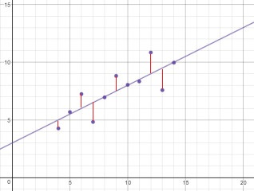
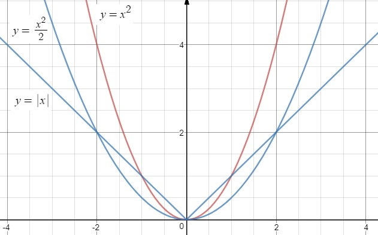
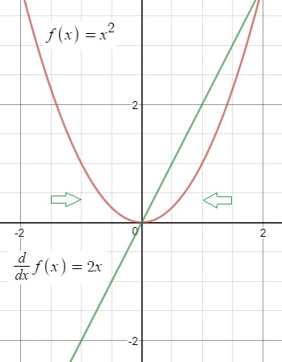

# 회귀 Regression
-----------------
```
아래와 같은 데이터가 존재한다고 가정해 보자
```
>

```
모든 점을 지날 수는 없지만 1차 함수로 표현하는 것을 생각할 수 있다
```

>

```
가장 데이터를 잘 나타내는 매개변수(theta)를 구하는 것을 목표로 한다
위의 식에서는 기울기(theta1)와 절편(theta0)을 찾는 것이 된다
```

### 오차함수(목적함수)
```
오차는 관측값과 함수값의 차이(붉은선)을 말한다
오차의 합을 최소화하면 적당한 매개변수를 찾았다고 말할 수 있다
```
```
관측값을 y라 할 때 오차함수는 다음과 같이 쓸 수 있다
E는 오차(Error)를 의미한다
```
> 
```

차이를 제곱을 한 것과 1/2를 곱한 이유는 미분과 관계가 있다
  - 제곱이 아닌 절댓값을 사용하면 미분할 수 없는 부분이 생긴다
  - 1/2를 곱한 이유는 미분 이후에 식을 정리하기 위함이다
    - 1/2를 곱해도 최솟값의 위치는 변하지 않는다
```

> 

### 경사하강법(최급하강법)
```
오차함수의 도함수를 구하고 도함수의 부호를 활용하여 최솟값의 위치를 구한다
도함수 부호의 반대 방향으로 밀면 함수의 최솟값을 향해 움직이는 것을 이용한다
얼마만큼 이동할 것인가는 학습률(eta)로 정할수 있으며 수렴하는 속도를 결정하게 된다
```

> 

```
위 내용을 종합하여 매개변수 갱신식을 나타내면 다음과 같다
```
> 

### 목적함수가 최솟값이 되는 매개변수 결정
>

```
목적함수는 theta0과 theta1을 가지고 있는 f(x)를 포함한다
이와같은 매개변수가 두 개인 이변수 함수는 편미분을 계산해야 한다 (d -> round-d)
따라서 매개변수 갱신식은 다음과 같다
```

>

>

```
E안에 f가 있기 때문에 합성함수의 미분을 사용한다
합성함수 미분에 대한 간략한 예는 아래와 같다
```
>

>

>

>

>

>

```
각 매개변수에 대해 미분한다
```

>

>

```
첫번째 매개변수(theta0) 미분
```

>

>

>>

>>

>>

>

```
정리하면
```
>

>>

>>

```
두번째 매개변수(theta1) 미분
```
>

```
앞쪽 미분은 첫번째와 같으므로 뒤쪽만 하면 된다
```
>

```
결과는 아래와 같다
```
>

>>

>>

```
최종 갱신식은 다음과 같다
```
>

>

```
1차 함수의 회귀의 예를 들었지만, n차 함수로 확장하여 생각해 볼 수도 있다
```
>

```
n차를 생각하기 전에 2차 함수와 갱신식을 보면
```
>

>

>

>

```
합성함수 미분의 앞쪽은 변화하지 않고 뒤쪽의 차수만 증가하는 것을 확인할 수 있다
이렇게 차수를 늘린 함수를 사용하는 것을 다항식 회귀라고 한다
```

```
x^k의 매개변수인 theta-k의 갱신식은 다음과 같다
```
>

```
차수가 아닌 변수(파라메터 or 피처)의 개수가 늘어난 경우도 생각해 볼 수 있다
식으로 나타내면 다음과 같다
```
>

```
이런 형태인 경우에는 벡터를 이용해 표현하면 간단하다
차원을 맞추기 위해서 1을 추가한다
```
>

>

```
벡터를 전치해서 서로 곱하면 표현이 간단해 진다
```
>

>

```
j번째 매개변수의 갱신식도 편미분과 합성함수의 미분을 이용한다
```
>

>>

>

>

```
따라서 j번째 매개변수의 갱신식은 다음과 같다
이렇게 여러 개의 변수를 사용하는 것을 중회귀라 한다
```
>

### 경사하강법의 단점
```
모든 학습 데이터에 대해 계산하면 느리며 국소해에 빠질 가능성이 있다
```
#### 확률 경사하강법
```
학습 데이터를 무작위로 골라서 매개변수 갱신에 사용한다
(k는 무작위로 선택한 인덱스)
```
>

#### 미니배치법
```
무작위로 m개 선택한 학습 데이터의 인덱스 집합을 K라고 두면 아래와 같다
```
>
